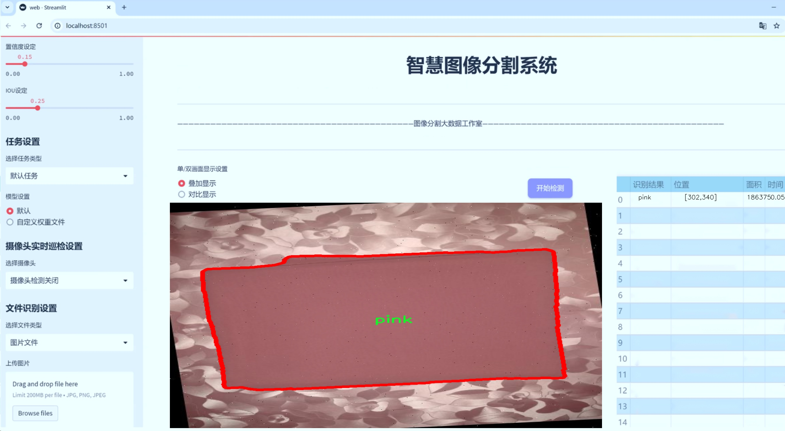

# 颜色分割系统源码＆数据集分享
 [yolov8-seg-HGNetV2＆yolov8-seg-p6等50+全套改进创新点发刊_一键训练教程_Web前端展示]

### 1.研究背景与意义

项目参考[ILSVRC ImageNet Large Scale Visual Recognition Challenge](https://gitee.com/YOLOv8_YOLOv11_Segmentation_Studio/projects)

项目来源[AAAI Global Al lnnovation Contest](https://kdocs.cn/l/cszuIiCKVNis)

研究背景与意义

随着计算机视觉技术的迅速发展，目标检测与图像分割在各个领域的应用愈发广泛，尤其是在自动驾驶、智能监控、医疗影像分析等领域。颜色作为物体的重要特征之一，能够为目标检测和分割提供丰富的信息。传统的目标检测方法在处理复杂场景时，往往受到光照变化、物体遮挡和背景干扰等因素的影响，导致检测精度下降。因此，基于颜色信息的目标检测与分割技术逐渐成为研究的热点。

YOLO（You Only Look Once）系列模型以其高效的实时检测能力和较高的准确性，成为目标检测领域的重要代表。YOLOv8作为该系列的最新版本，进一步提升了模型的性能和适用性。然而，尽管YOLOv8在目标检测方面表现优异，但在颜色分割任务中仍存在一定的局限性，尤其是在处理多类别、多色彩的复杂场景时。因此，改进YOLOv8以增强其在颜色分割任务中的表现，具有重要的研究意义。

本研究将基于改进YOLOv8的颜色分割系统，利用一个包含1400张图像和10个颜色类别（黑色、蓝色、绿色、橙色、紫色、白色、黄色、棕色、粉色和红色）的数据集，探索如何通过优化模型结构和训练策略，提高颜色分割的准确性和鲁棒性。该数据集的多样性和丰富性为模型的训练提供了良好的基础，能够有效地模拟现实场景中的颜色变化和物体特征。

通过对YOLOv8的改进，我们将引入新的特征提取模块，以更好地捕捉颜色信息，并结合实例分割技术，提升模型在复杂背景下的分割精度。此外，研究还将探讨数据增强技术在颜色分割中的应用，以提高模型的泛化能力，减少过拟合现象。这些改进不仅有助于提升模型在颜色分割任务中的表现，也为其他计算机视觉任务提供了新的思路和方法。

在实际应用中，基于改进YOLOv8的颜色分割系统可以广泛应用于智能监控、自动驾驶、机器人视觉等领域。例如，在智能监控中，系统能够实时识别和分割特定颜色的物体，帮助安全人员快速定位可疑目标；在自动驾驶中，系统能够识别交通标志和信号灯的颜色，为车辆的安全行驶提供重要依据；在机器人视觉中，系统能够帮助机器人识别和分类不同颜色的物体，实现更智能的交互和操作。

综上所述，基于改进YOLOv8的颜色分割系统的研究，不仅具有重要的理论意义，也具备广泛的应用前景。通过深入探索颜色信息在目标检测与分割中的作用，我们期待能够推动计算机视觉技术的进一步发展，为相关领域的应用提供更为高效和准确的解决方案。

### 2.图片演示




##### 注意：由于此博客编辑较早，上面“2.图片演示”和“3.视频演示”展示的系统图片或者视频可能为老版本，新版本在老版本的基础上升级如下：（实际效果以升级的新版本为准）

  （1）适配了YOLOV8的“目标检测”模型和“实例分割”模型，通过加载相应的权重（.pt）文件即可自适应加载模型。

  （2）支持“图片识别”、“视频识别”、“摄像头实时识别”三种识别模式。

  （3）支持“图片识别”、“视频识别”、“摄像头实时识别”三种识别结果保存导出，解决手动导出（容易卡顿出现爆内存）存在的问题，识别完自动保存结果并导出到tempDir中。

  （4）支持Web前端系统中的标题、背景图等自定义修改，后面提供修改教程。

  另外本项目提供训练的数据集和训练教程,暂不提供权重文件（best.pt）,需要您按照教程进行训练后实现图片演示和Web前端界面演示的效果。

### 3.视频演示

[3.1 视频演示](https://www.bilibili.com/video/BV1X8mPYREKk/)

### 4.数据集信息展示

##### 4.1 本项目数据集详细数据（类别数＆类别名）

nc: 10
names: ['Black', 'Blue', 'Green', 'Orange', 'Purple', 'White', 'Yellow', 'brown', 'pink', 'red']


##### 4.2 本项目数据集信息介绍

数据集信息展示

在计算机视觉领域，颜色分割是一个重要的研究方向，尤其是在目标检测和图像分割任务中。为了提升YOLOv8-seg模型在颜色分割任务中的表现，我们使用了名为“Color detection”的数据集。该数据集专门设计用于训练和评估模型在多种颜色识别和分割任务中的能力，具有丰富的多样性和代表性，能够有效支持模型的学习和泛化。

“Color detection”数据集包含10个不同的颜色类别，分别为：黑色（Black）、蓝色（Blue）、绿色（Green）、橙色（Orange）、紫色（Purple）、白色（White）、黄色（Yellow）、棕色（Brown）、粉色（Pink）和红色（Red）。这些颜色类别涵盖了从基础色到较为复杂的色调，提供了一个广泛的颜色范围，使得模型能够学习到不同颜色的特征和分布。每个类别都包含了大量的图像样本，这些样本在光照、背景和物体形状等方面具有多样性，确保了模型在训练过程中能够接触到各种可能的场景。

数据集中的图像经过精心挑选和标注，确保每个颜色类别的样本都能准确反映其特征。标注过程中，使用了精确的分割掩码，使得每个颜色区域都被清晰地标识出来。这种高质量的标注不仅有助于模型在训练阶段更好地理解颜色与形状之间的关系，还能在测试阶段提供可靠的评估标准，确保模型的性能评估具有公正性和科学性。

在数据集的构建过程中，考虑到了不同环境下的颜色表现，例如在自然光、人工光源下的颜色变化，以及不同材质对颜色的影响。这种多样化的样本选择，使得“Color detection”数据集不仅适用于静态图像的处理，也能够为动态场景中的颜色检测提供有效的支持。通过这样的设计，模型能够在实际应用中更好地适应各种复杂的环境，提升其鲁棒性和准确性。

此外，数据集还包含了一些具有挑战性的样本，例如颜色相近的物体、低对比度的场景等，这些样本能够有效地推动模型在边界条件下的学习能力。通过在训练过程中引入这些复杂的样本，模型能够逐步提升其对颜色的敏感度和分辨能力，从而在实际应用中表现出更高的精度和可靠性。

总之，“Color detection”数据集为改进YOLOv8-seg的颜色分割系统提供了坚实的基础。通过对多样化颜色类别的深入学习，模型将能够在各种应用场景中实现高效的颜色分割，满足不同领域对颜色识别的需求。这一数据集不仅为研究人员提供了一个宝贵的资源，也为未来的研究和应用奠定了基础，推动了颜色分割技术的进一步发展。


### 5.全套项目环境部署视频教程（零基础手把手教学）

[5.1 环境部署教程链接（零基础手把手教学）](https://www.bilibili.com/video/BV1jG4Ve4E9t/?vd_source=bc9aec86d164b67a7004b996143742dc)


[5.2 安装Python虚拟环境创建和依赖库安装视频教程链接（零基础手把手教学）](https://www.bilibili.com/video/BV1nA4VeYEze/?vd_source=bc9aec86d164b67a7004b996143742dc)

### 6.手把手YOLOV8-seg训练视频教程（零基础小白有手就能学会）

[6.1 手把手YOLOV8-seg训练视频教程（零基础小白有手就能学会）](https://www.bilibili.com/video/BV1cA4VeYETe/?vd_source=bc9aec86d164b67a7004b996143742dc)


按照上面的训练视频教程链接加载项目提供的数据集，运行train.py即可开始训练



     Epoch   gpu_mem       box       obj       cls    labels  img_size
     1/200     0G   0.01576   0.01955  0.007536        22      1280: 100%|██████████| 849/849 [14:42<00:00,  1.04s/it]
               Class     Images     Labels          P          R     mAP@.5 mAP@.5:.95: 100%|██████████| 213/213 [01:14<00:00,  2.87it/s]
                 all       3395      17314      0.994      0.957      0.0957      0.0843

     Epoch   gpu_mem       box       obj       cls    labels  img_size
     2/200     0G   0.01578   0.01923  0.007006        22      1280: 100%|██████████| 849/849 [14:44<00:00,  1.04s/it]
               Class     Images     Labels          P          R     mAP@.5 mAP@.5:.95: 100%|██████████| 213/213 [01:12<00:00,  2.95it/s]
                 all       3395      17314      0.996      0.956      0.0957      0.0845

     Epoch   gpu_mem       box       obj       cls    labels  img_size
     3/200     0G   0.01561    0.0191  0.006895        27      1280: 100%|██████████| 849/849 [10:56<00:00,  1.29it/s]
               Class     Images     Labels          P          R     mAP@.5 mAP@.5:.95: 100%|███████   | 187/213 [00:52<00:00,  4.04it/s]
                 all       3395      17314      0.996      0.957      0.0957      0.0845


### 7.50+种全套YOLOV8-seg创新点代码加载调参视频教程（一键加载写好的改进模型的配置文件）

[7.1 50+种全套YOLOV8-seg创新点代码加载调参视频教程（一键加载写好的改进模型的配置文件）](https://www.bilibili.com/video/BV1Hw4VePEXv/?vd_source=bc9aec86d164b67a7004b996143742dc)

### 8.YOLOV8-seg图像分割算法原理

原始YOLOv8-seg算法原理

YOLOv8-seg算法是YOLO系列的最新版本，于2023年1月10日发布，标志着计算机视觉领域中目标检测和实例分割技术的又一次重大飞跃。作为YOLO系列的最新王者，YOLOv8不仅在精度和执行时间上超越了所有已知模型，还在设计上融入了YOLOv5、YOLOv6和YOLOX等前辈模型的优点，形成了一种更为高效、灵活的目标检测与分割方案。其独特的算法原理和架构设计，使得YOLOv8-seg在处理复杂场景和多样化目标时展现出卓越的性能。

YOLOv8-seg的核心在于其全新的骨干网络和解耦合检测头。首先，YOLOv8的骨干网络采用了更深的卷积神经网络结构，利用CSP（跨阶段局部网络）思想，通过引入C2f模块，显著提升了特征提取的能力。C2f模块不仅保留了YOLOv5中的残差连接，还增加了更多的跳层连接和Split操作，使得网络在保持轻量化的同时，能够获得更丰富的梯度信息。这种设计使得YOLOv8在处理小目标和高分辨率图像时表现出色，极大地提高了检测的准确性。

其次，YOLOv8-seg在检测头的设计上进行了重大创新，采用了Anchor-Free的解耦合结构。这一变化使得模型不再依赖于传统的Anchor-Based方法，避免了Anchor选择带来的复杂性和不确定性。解耦合检测头将分类和回归任务分开处理，使得模型在训练和推理过程中更加高效。通过这种方式，YOLOv8-seg能够在不同尺度和不同类型的目标上实现更为精准的检测与分割，尤其是在复杂背景下的表现尤为突出。

YOLOv8-seg还引入了多尺度训练和测试的策略，结合特征金字塔网络（PAN-FPN），进一步提升了模型的检测性能。通过对不同尺度的特征进行融合，YOLOv8-seg能够有效捕捉到目标的多样性和复杂性，从而在不同场景下保持高精度的检测效果。这种多尺度的处理方式，使得YOLOv8-seg在智能监控、自动驾驶和人脸识别等应用中展现出广泛的适用性。

在损失函数的设计上，YOLOv8-seg也进行了创新，采用了BCELoss作为分类损失，DFLLoss和CIoULoss作为回归损失。这种组合不仅提高了模型的训练效率，还增强了其在复杂场景下的鲁棒性。通过精确的损失计算，YOLOv8-seg能够更好地优化模型参数，提升整体性能。

值得一提的是，YOLOv8-seg在工程化实现上也保持了YOLOv5的简洁易用特性，使得开发者能够快速上手并应用于实际项目中。其灵活的模型结构和多样的配置选项，使得用户可以根据具体需求选择合适的模型版本，从而在精度和速度之间找到最佳平衡。

总的来说，YOLOv8-seg算法通过对骨干网络、检测头和损失函数的全面改进，形成了一种高效、灵活的目标检测与分割方案。其在精度和执行时间上的优势，使得YOLOv8-seg成为当前计算机视觉领域中最先进的模型之一，能够广泛应用于各种复杂场景，为智能监控、自动驾驶和人脸识别等领域提供强有力的技术支持。随着YOLOv8-seg的不断发展和完善，未来的计算机视觉技术将会迎来更多的创新与突破。


### 9.系统功能展示（检测对象为举例，实际内容以本项目数据集为准）

图9.1.系统支持检测结果表格显示

  图9.2.系统支持置信度和IOU阈值手动调节

  图9.3.系统支持自定义加载权重文件best.pt(需要你通过步骤5中训练获得)

  图9.4.系统支持摄像头实时识别

  图9.5.系统支持图片识别

  图9.6.系统支持视频识别

  图9.7.系统支持识别结果文件自动保存

  图9.8.系统支持Excel导出检测结果数据


### 10.50+种全套YOLOV8-seg创新点原理讲解（非科班也可以轻松写刊发刊，V11版本正在科研待更新）

#### 10.1 由于篇幅限制，每个创新点的具体原理讲解就不一一展开，具体见下列网址中的创新点对应子项目的技术原理博客网址【Blog】：


[10.1 50+种全套YOLOV8-seg创新点原理讲解链接](https://gitee.com/qunmasj/good)

#### 10.2 部分改进模块原理讲解(完整的改进原理见上图和技术博客链接)【如果此小节的图加载失败可以通过CSDN或者Github搜索该博客的标题访问原始博客，原始博客图片显示正常】

### YOLOv8简介
#### YOLOv8是什么？
YOLOv8是Ultralytics公司推出的基于对象检测模型的YOLO最新系列，它能够提供截至目前最先进的对象检测性能。

借助于以前的YOLO模型版本支持技术，YOLOv8模型运行得更快、更准确，同时为执行任务的训练模型提供了统一的框架，这包括：

目标检测
实例分割
图像分类
在撰写本文时，Ultralytics的YOLOv8存储库中其实还有很多功能有待添加，这包括训练模型的整套导出功能等。此外，Ultralytics将计划在Arxiv上发布一篇相关的论文，将对YOLOv8与其他最先进的视觉模型进行比较。

#### YOLOv8的新功能
Ultralytics为YOLO模型发布了一个全新的存储库（https://github.com/ultralytics/ultralytics）。该存储库被构建为用于训练对象检测、实例分割和图像分类模型的统一框架。

以下列举的是这个新版本的一些关键功能：

用户友好的API（命令行+Python）。
更快、更准确。
支持：
目标检测，
实例分割和
图像分类。
可扩展到所有以前的版本。
新的骨干网络。
新的Anchor-Free head对象检测算法。
新的损失函数。
此外，YOLOv8也非常高效和灵活，它可以支持多种导出格式，而且该模型可以在CPU和GPU上运行。

#### YOLOv8中提供的子模型


YOLOv8模型的每个类别中共有五个模型，以便共同完成检测、分割和分类任务。其中，YOLOv8 Nano是最快和最小的模型，而YOLOv8Extra Large（YOLOv8x）是其中最准确但最慢的模型。

YOLOv8这次发行中共附带了以下预训练模型：

在图像分辨率为640的COCO检测数据集上训练的对象检测检查点。
在图像分辨率为640的COCO分割数据集上训练的实例分割检查点。
在图像分辨率为224的ImageNet数据集上预处理的图像分类模型。
### 高效网络架构 CloAtt简介
众所周知，自从 ViTs 提出后，Transformer 基本横扫各大 CV 主流任务，包括视觉识别、目标检测和语义分割等。然而，一个比较棘手的问题就是这个架构参数量和计算量太大，所以一直被广受诟病。因此，后续有不少工作都是朝着这个方向去改进，例如 Swin-Transformer 在局部非重叠窗口中进行注意力计算，而 PVT 中则是使用平均池化来合并 token 以进一步压缩耗时。然而，这些 ViTs 由于其参数量太大以及高 FLOPs 并不适合部署到移动设备。如果我们直接缩小到适合移动设备的尺寸时，它们的性能又会显著降低。


#### MobileViT
因此，出现了不少工作聚焦于探索轻量级的视觉变换器，使 ViTs 适用于移动设备，CVHub 此前也介绍过不少的工作，大家有兴趣可以翻阅历史文章读读。例如，苹果团队提出的 MobileViT 研究了如何将 CNN 与 Transformer 相结合，而另一个工作 MobileFormer 则将轻量级的 MobileNet 与 Transformer 进行融合。此外，最新提出的 EdgeViT 提出了一个局部-全局-局部模块来聚合信息。以上工作的目标都是设计具有高性能、较少参数和低 FLOPs 的移动端友好型模型。


#### EdgeViT
然而，作者从频域编码的角度认为，在现有的轻量级模型中，大多数方法只关注设计稀疏注意力，以有效地处理低频全局信息，而使用相对简单的方法处理高频局部信息。具体而言，大多数模型如 EdgeViT 和 MobileViT，只是简单使用原始卷积提取局部表示，这些方法仅使用卷积中的全局共享权重处理高频本地信息。其他方法，如 LVT ，则是首先将标记展开到窗口中，然后使用窗口内的注意力获得高频信息。这些方法仅使用特定于每个 Token 的上下文感知权重进行局部感知。


#### LVT
虽然上述轻量级模型在多个数据集上取得了良好的结果，但没有一种方法尝试设计更有效的方法，即利用共享和上下文感知权重的优势来处理高频局部信息。基于共享权重的方法，如传统的卷积神经网络，具有平移等变性的特征。与它们不同，基于上下文感知权重的方法，如 LVT 和 NAT，具有可以随输入内容变化的权重。这两种类型的权重在局部感知中都有自己的优势。
#### NAT


受该博客的启发，本文设计了一种轻量级视觉变换器——CloAtt，其利用了上下文感知的局部增强。特别地，CloAtt 采用了双分支设计结构。
#### 局部分支
在局部分支中，本文引入了一个精心设计的 AttnConv，一种简单而有效的卷积操作符，它采用了注意力机制的风格。所提出的 AttnConv 有效地融合了共享权重和上下文感知权重，以聚合高频的局部信息。具体地，AttnConv 首先使用深度卷积（DWconv）提取局部表示，其中 DWconv 具有共享权重。然后，其使用上下文感知权重来增强局部特征。与 Non-Local 等生成上下文感知权重的方法不同，AttnConv 使用门控机制生成上下文感知权重，引入了比常用的注意力机制更强的非线性。此外，AttnConv 将卷积算子应用于 Query 和 Key 以聚合局部信息，然后计算 Q 和 K 的哈达玛积，并对结果进行一系列线性或非线性变换，生成范围在 [-1,1] 之间的上下文感知权重。值得注意的是，AttnConv 继承了卷积的平移等变性，因为它的所有操作都基于卷积。
#### 全局分支
在全局分支中则使用了传统的注意力机制，但对 K 和 V 进行了下采样以减少计算量，从而捕捉低频全局信息。最后，CloFormer 通过简单的方法将局部分支和全局分支的输出进行融合，从而使模型能够同时捕捉高频和低频信息。总的来说，CloFormer 的设计能够同时发挥共享权重和上下文感知权重的优势，提高其局部感知的能力，使其在图像分类、物体检测和语义分割等多个视觉任务上均取得了优异的性能。
如上图2所示，CloFormer 共包含一个卷积主干和四个 stage，每个 stage you Clo 模块 和 ConvFFN 组合而成的模块堆叠而成 。具体得，首先将输入图像通过卷积主干传递，以获取 token 表示。该主干由四个卷积组成，每个卷积的步长依次为2、2、1和1。接下来，tokens 经历四个 Clo 块和 ConvFFN 阶段，以提取分层特征。最后，再利用全局平均池化和全连接层生成预测结果。可以看出，整个架构非常简洁，支持即插即用！


#### ConvFFN
为了将局部信息融入 FFN 过程中，本文采用 ConvFFN 替换了常用的 FFN。ConvFFN 和常用的 FFN 的主要区别在于，ConvFFN 在 GELU 激活函数之后使用了深度卷积（DWconv），从而使 ConvFFN 能够聚合局部信息。由于DWconv 的存在，可以直接在 ConvFFN 中进行下采样而不需要引入 PatchMerge 模块。CloFormer 使用了两种ConvFFN。第一种是在阶段内的 ConvFFN，它直接利用跳跃连接。另一种是连接两个阶段的 ConvFFN，主要用于下采样操作。
#### Clo block
CloFormer 中的 Clo块 是非常关键的组件。每个 Clo 块由一个局部分支和一个全局分支组成。在全局分支中，我们首先下采样 K 和 V，然后对 Q、K 和 V 进行标准的 attention 操作，以提取低频全局信息。
虽然全局分支的设计能够有效减少注意力机制所需的浮点运算次数，并且能够获得全局的感受野。然而，它在处理高频局部信息方面的能力不足。为了解决这个问题，CloFormer 引入了局部分支，并使用 AttnConv 对高频局部信息进行处理。AttnConv 可以融合共享权重和上下文感知权重，能够更好地处理高频局部信息。因此，CloFormer 结合了全局和局部的优势来提高图像分类性能。下面我们重点讲下 AttnConv 。
#### AttnConv
AttnConv 是一个关键模块，使得所提模型能够获得高性能。它结合了一些标准的 attention 操作。具体而言，在AttnConv 中，我们首先进行线性变换以获得 Q、K和V。在进行线性变换之后，我们再对 V 进行共享权重的局部特征聚合。然后，基于处理后的 V 和 Q ，K 进行上下文感知的局部增强。具体流程可对照流程图理解，我们可以将其拆解成三个步骤。
#### Local Feature Aggregation
为了简单起见，本文直接使用一个简单的深度卷积（DWconv）来对 V 进行局部信息聚合。
#### Context-aware Local Enhancement
在将具有共享权重的局部信息整合到 V 中后，我们结合 Q 和 K 生成上下文感知权重。值得注意的是，我们使用了与局部自注意力不同的方法，该方法更加简洁。具体而言，我们首先使用两个 DWconv 对 Q 和 K 分别进行局部信息聚合。然后，我们计算 Q 和 K 的 Hadamard 乘积，并对结果进行一系列转换，以获取在 -1 到 1 之间的上下文感知权重。最后，我们使用生成的权重来增强局部特征。
#### Fusion with Global Branch
在整个 CloFormer 中，我们使用一种简单直接的方法来将局部分支和全局分支的输出进行融合。具体而言，本文是通过将这两个输出在通道维度上进行直接拼接，然后再通过一个 FC 层聚合这些特征并结合残差输出。
最后，上图展示了三种不同的方法。相比于传统卷积，AttnConv 中的上下文感知权重使得模型能够更好地适应输入内容。相比于局部自注意力机制，引入共享权重使得模型能够更好地处理高频信息，从而提高性能。此外，生成上下文感知权重的方法引入了更强的非线性性，也提高了性能。需要注意的是，AttnConv 中的所有操作都基于卷积，保持了卷积的平移等变性特性。


### 11.项目核心源码讲解（再也不用担心看不懂代码逻辑）

#### 11.1 ui.py

以下是对给定代码的核心部分进行提炼和详细注释的版本：

```python
import sys
import subprocess

def run_script(script_path):
    """
    使用当前 Python 环境运行指定的脚本。

    Args:
        script_path (str): 要运行的脚本路径

    Returns:
        None
    """
    # 获取当前 Python 解释器的路径
    python_path = sys.executable

    # 构建运行命令，使用 streamlit 运行指定的脚本
    command = f'"{python_path}" -m streamlit run "{script_path}"'

    # 执行命令并等待其完成
    result = subprocess.run(command, shell=True)
    
    # 检查命令执行的返回码，0 表示成功，非0表示出错
    if result.returncode != 0:
        print("脚本运行出错。")

# 主程序入口
if __name__ == "__main__":
    # 指定要运行的脚本路径
    script_path = "web.py"  # 这里假设脚本在当前目录下

    # 调用函数运行指定的脚本
    run_script(script_path)
```

### 代码核心部分分析与注释：

1. **导入模块**：
   - `import sys`: 导入 `sys` 模块以获取当前 Python 解释器的路径。
   - `import subprocess`: 导入 `subprocess` 模块以便在 Python 中执行外部命令。

2. **定义 `run_script` 函数**：
   - 该函数接受一个参数 `script_path`，表示要运行的 Python 脚本的路径。
   - 使用 `sys.executable` 获取当前 Python 解释器的路径。
   - 构建命令字符串，使用 `streamlit` 模块运行指定的脚本。
   - 使用 `subprocess.run` 执行命令，并等待其完成。
   - 检查命令的返回码，如果返回码不为 0，则打印错误信息。

3. **主程序入口**：
   - 使用 `if __name__ == "__main__":` 确保只有在直接运行该脚本时才会执行以下代码。
   - 指定要运行的脚本路径为 `web.py`。
   - 调用 `run_script` 函数，传入脚本路径以执行该脚本。

通过这些注释，代码的功能和逻辑变得更加清晰，便于理解和维护。

这个文件是一个 Python 脚本，主要功能是运行一个名为 `web.py` 的 Streamlit 应用。首先，文件导入了必要的模块，包括 `sys`、`os` 和 `subprocess`，这些模块提供了与系统交互的功能。

在 `run_script` 函数中，首先获取当前 Python 解释器的路径，这样可以确保在正确的环境中运行脚本。接着，构建一个命令字符串，该命令使用当前的 Python 解释器和 Streamlit 模块来运行指定的脚本。命令的格式是 `python -m streamlit run "script_path"`，其中 `script_path` 是要运行的脚本的路径。

随后，使用 `subprocess.run` 方法执行这个命令。这个方法会在新的进程中运行命令，并等待其完成。如果脚本运行返回的状态码不为零，表示运行过程中出现了错误，此时会打印出一条错误信息。

在文件的最后部分，使用 `if __name__ == "__main__":` 语句来确保只有在直接运行该脚本时才会执行后面的代码。在这里，首先调用 `abs_path` 函数来获取 `web.py` 的绝对路径，然后调用 `run_script` 函数来运行这个脚本。

总的来说，这个文件的作用是提供一个简单的接口，通过命令行运行一个 Streamlit 应用，确保在当前 Python 环境中执行，并处理可能出现的错误。

#### 11.2 ultralytics\utils\errors.py

```python
# 导入所需的工具函数
from ultralytics.utils import emojis

class HUBModelError(Exception):
    """
    自定义异常类，用于处理与Ultralytics YOLO模型获取相关的错误。

    当请求的模型未找到或无法检索时，将引发此异常。
    消息经过处理，以包含表情符号，从而改善用户体验。

    属性:
        message (str): 引发异常时显示的错误消息。

    注意:
        消息会通过'ultralytics.utils'包中的'emojis'函数自动处理。
    """

    def __init__(self, message='Model not found. Please check model URL and try again.'):
        """当模型未找到时创建异常。"""
        # 调用父类的构造函数，并将处理过的消息传递给它
        super().__init__(emojis(message))
```

### 代码核心部分及注释说明：

1. **导入emojis函数**：
   - 从`ultralytics.utils`模块导入`emojis`函数，用于处理消息中的表情符号，以增强用户体验。

2. **定义HUBModelError类**：
   - 继承自Python内置的`Exception`类，创建一个自定义异常类`HUBModelError`，用于特定于Ultralytics YOLO模型的错误处理。

3. **文档字符串**：
   - 提供类的描述，包括用途、属性和注意事项，便于后续开发者理解该异常类的功能。

4. **构造函数__init__**：
   - 定义了一个构造函数，接受一个可选的消息参数，默认值为“模型未找到，请检查模型URL并重试。”。
   - 在构造函数中，调用父类的构造函数，并将经过`emojis`处理的消息传递给它，以确保异常消息包含表情符号。

这个程序文件定义了一个自定义异常类 `HUBModelError`，用于处理与 Ultralytics YOLO 模型获取相关的错误。该类继承自 Python 的内置异常类 `Exception`，并在初始化时接收一个可选的错误消息参数。默认情况下，错误消息为“Model not found. Please check model URL and try again.”，即“未找到模型。请检查模型 URL 并重试。”

在这个类的构造函数中，调用了父类的构造函数，并使用 `ultralytics.utils` 模块中的 `emojis` 函数对错误消息进行了处理。这意味着当异常被抛出时，消息中可能会包含一些表情符号，以增强用户体验，使得错误信息更加生动和易于理解。

总的来说，这个文件的主要目的是提供一个清晰的机制来处理模型未找到的情况，并通过使用表情符号来改善用户反馈。

#### 11.3 train.py

以下是经过简化和注释的核心代码部分：

```python
import os
import torch
import yaml
from ultralytics import YOLO  # 导入YOLO模型库

if __name__ == '__main__':  # 确保该模块被直接运行时才执行以下代码
    # 设置训练参数
    workers = 1  # 数据加载的工作进程数
    batch = 8  # 每个批次的样本数量
    device = "0" if torch.cuda.is_available() else "cpu"  # 判断是否使用GPU

    # 获取数据集配置文件的绝对路径
    data_path = abs_path(f'datasets/data/data.yaml', path_type='current')

    # 读取YAML文件，保持原有顺序
    with open(data_path, 'r') as file:
        data = yaml.load(file, Loader=yaml.FullLoader)

    # 修改数据路径，确保路径正确
    if 'train' in data and 'val' in data and 'test' in data:
        directory_path = os.path.dirname(data_path)  # 获取数据集目录
        data['train'] = os.path.join(directory_path, 'train')  # 更新训练集路径
        data['val'] = os.path.join(directory_path, 'val')  # 更新验证集路径
        data['test'] = os.path.join(directory_path, 'test')  # 更新测试集路径

        # 将修改后的数据写回YAML文件
        with open(data_path, 'w') as file:
            yaml.safe_dump(data, file, sort_keys=False)

    # 加载YOLO模型配置文件和预训练权重
    model = YOLO(r"C:\codeseg\codenew\50+种YOLOv8算法改进源码大全和调试加载训练教程（非必要）\改进YOLOv8模型配置文件\yolov8-seg-C2f-Faster.yaml").load("./weights/yolov8s-seg.pt")

    # 开始训练模型
    results = model.train(
        data=data_path,  # 指定训练数据的配置文件路径
        device=device,  # 使用的设备（GPU或CPU）
        workers=workers,  # 数据加载的工作进程数
        imgsz=640,  # 输入图像的大小
        epochs=100,  # 训练的轮数
        batch=batch,  # 每个批次的样本数量
    )
```

### 代码注释说明：
1. **导入必要的库**：导入了操作系统、PyTorch、YAML解析库和YOLO模型库。
2. **主程序入口**：使用`if __name__ == '__main__':`确保代码只在直接运行时执行。
3. **设置训练参数**：定义了数据加载的工作进程数、批次大小和设备（GPU或CPU）。
4. **读取和修改数据集配置**：读取YAML文件，修改训练、验证和测试数据的路径，并将修改后的内容写回文件。
5. **加载YOLO模型**：根据指定的配置文件和预训练权重加载YOLO模型。
6. **训练模型**：调用`model.train()`方法开始训练，传入必要的参数，如数据路径、设备、工作进程数、图像大小和训练轮数。

这个程序文件 `train.py` 是用于训练 YOLO（You Only Look Once）目标检测模型的脚本。首先，它导入了必要的库，包括操作系统库 `os`、深度学习框架 `torch`、YAML 处理库 `yaml`、YOLO 模型库 `ultralytics` 以及用于图形界面的 `matplotlib`。

在 `__main__` 块中，程序首先设置了一些训练参数，包括工作进程数 `workers`、批次大小 `batch` 和设备选择 `device`。这里的设备选择会检查是否有可用的 GPU，如果有则使用 GPU（设备编号为 "0"），否则使用 CPU。

接下来，程序构建了数据集配置文件的绝对路径 `data_path`，这个路径指向一个 YAML 文件，里面包含了训练、验证和测试数据集的路径。然后，程序将路径格式转换为 Unix 风格，并提取出目录路径 `directory_path`。

程序随后打开 YAML 文件并读取其内容。它检查 YAML 文件中是否包含 `train`、`val` 和 `test` 项，如果存在，则将这些项的路径修改为当前目录下的 `train`、`val` 和 `test` 文件夹，并将修改后的内容写回 YAML 文件。这一步是为了确保数据集路径的正确性。

接下来，程序加载 YOLO 模型的配置文件，并使用预训练的权重文件进行初始化。这里使用的是一个特定的 YOLOv8 模型配置文件。

最后，程序调用 `model.train()` 方法开始训练模型，传入的数据配置文件路径、设备、工作进程数、输入图像大小（640x640）、训练的 epoch 数（100）以及批次大小（8）。通过这些参数，模型将开始在指定的数据集上进行训练。

总的来说，这个脚本的主要功能是设置训练环境、准备数据集路径、加载模型并启动训练过程。

#### 11.4 ultralytics\utils\atss.py

以下是代码中最核心的部分，并附上详细的中文注释：

```python
import torch
import torch.nn as nn
import torch.nn.functional as F

def generate_anchors(feats, fpn_strides, grid_cell_size=5.0, grid_cell_offset=0.5, device='cpu', is_eval=False, mode='af'):
    '''根据特征生成锚框（anchors）。'''
    anchors = []  # 存储生成的锚框
    anchor_points = []  # 存储锚点
    stride_tensor = []  # 存储步幅信息
    num_anchors_list = []  # 存储每个特征层的锚框数量

    assert feats is not None  # 确保特征不为空

    if is_eval:  # 如果是评估模式
        for i, stride in enumerate(fpn_strides):
            _, _, h, w = feats[i].shape  # 获取特征图的高度和宽度
            shift_x = torch.arange(end=w, device=device) + grid_cell_offset  # x方向的偏移
            shift_y = torch.arange(end=h, device=device) + grid_cell_offset  # y方向的偏移
            shift_y, shift_x = torch.meshgrid(shift_y, shift_x, indexing='ij')  # 创建网格
            anchor_point = torch.stack([shift_x, shift_y], axis=-1).to(torch.float)  # 生成锚点

            if mode == 'af':  # anchor-free模式
                anchor_points.append(anchor_point.reshape([-1, 2]))  # 将锚点展平并添加到列表
                stride_tensor.append(torch.full((h * w, 1), stride, dtype=torch.float, device=device))  # 记录步幅
            elif mode == 'ab':  # anchor-based模式
                anchor_points.append(anchor_point.reshape([-1, 2]).repeat(3, 1))  # 重复锚点以生成多个锚框
                stride_tensor.append(torch.full((h * w, 1), stride, dtype=torch.float, device=device).repeat(3, 1))  # 重复步幅

        anchor_points = torch.cat(anchor_points)  # 合并所有锚点
        stride_tensor = torch.cat(stride_tensor)  # 合并所有步幅信息
        return anchor_points, stride_tensor  # 返回锚点和步幅信息

    else:  # 如果是训练模式
        for i, stride in enumerate(fpn_strides):
            _, _, h, w = feats[i].shape  # 获取特征图的高度和宽度
            cell_half_size = grid_cell_size * stride * 0.5  # 计算锚框的一半大小
            shift_x = (torch.arange(end=w, device=device) + grid_cell_offset) * stride  # x方向的偏移
            shift_y = (torch.arange(end=h, device=device) + grid_cell_offset) * stride  # y方向的偏移
            shift_y, shift_x = torch.meshgrid(shift_y, shift_x, indexing='ij')  # 创建网格
            anchor = torch.stack([
                shift_x - cell_half_size, shift_y - cell_half_size,
                shift_x + cell_half_size, shift_y + cell_half_size
            ], axis=-1).clone().to(feats[0].dtype)  # 生成锚框
            anchor_point = torch.stack([shift_x, shift_y], axis=-1).clone().to(feats[0].dtype)  # 生成锚点

            if mode == 'af':  # anchor-free模式
                anchors.append(anchor.reshape([-1, 4]))  # 将锚框展平并添加到列表
                anchor_points.append(anchor_point.reshape([-1, 2]))  # 将锚点展平并添加到列表
            elif mode == 'ab':  # anchor-based模式
                anchors.append(anchor.reshape([-1, 4]).repeat(3, 1))  # 重复锚框以生成多个锚框
                anchor_points.append(anchor_point.reshape([-1, 2]).repeat(3, 1))  # 重复锚点以生成多个锚框
            num_anchors_list.append(len(anchors[-1]))  # 记录当前特征层的锚框数量
            stride_tensor.append(torch.full([num_anchors_list[-1], 1], stride, dtype=feats[0].dtype))  # 记录步幅信息

        anchors = torch.cat(anchors)  # 合并所有锚框
        anchor_points = torch.cat(anchor_points).to(device)  # 合并所有锚点并移动到指定设备
        stride_tensor = torch.cat(stride_tensor).to(device)  # 合并所有步幅信息并移动到指定设备
        return anchors, anchor_points, num_anchors_list, stride_tensor  # 返回锚框、锚点、锚框数量和步幅信息
```

### 代码核心部分说明：
1. **generate_anchors**：这个函数的主要作用是根据输入的特征图生成锚框（anchors）。它支持两种模式：`anchor-free`和`anchor-based`。在评估模式下，它只生成锚点；在训练模式下，它生成完整的锚框信息。

2. **参数说明**：
   - `feats`：输入的特征图。
   - `fpn_strides`：特征图的步幅。
   - `grid_cell_size`：网格单元的大小。
   - `grid_cell_offset`：网格单元的偏移量。
   - `device`：计算设备（CPU或GPU）。
   - `is_eval`：是否为评估模式。
   - `mode`：锚框生成模式（`af`或`ab`）。

3. **返回值**：
   - 在评估模式下，返回锚点和步幅信息；在训练模式下，返回锚框、锚点、锚框数量和步幅信息。

通过这些注释，代码的核心逻辑和功能得以清晰呈现。

这个程序文件 `ultralytics/utils/atss.py` 实现了一个用于目标检测的自适应训练样本选择分配器（ATSS Assigner）。该分配器的主要功能是根据预测的锚框和真实的目标框（ground truth boxes）之间的重叠情况，选择合适的样本进行训练。以下是对文件中各个部分的详细说明。

首先，文件导入了必要的库，包括 PyTorch 和一些自定义的函数。接着，定义了多个函数和一个类。

`generate_anchors` 函数用于生成锚框。根据输入的特征图（feats）和特征金字塔的步幅（fpn_strides），它计算锚框的位置和大小。该函数支持两种模式：anchor-free（无锚框）和 anchor-based（基于锚框）。在评估模式下，函数返回锚框的中心点和步幅张量；在训练模式下，返回锚框的坐标、中心点、锚框数量和步幅张量。

`fp16_clamp` 函数用于对张量进行限制，确保其值在指定的最小值和最大值之间，特别是在使用半精度浮点数（FP16）时。

`bbox_overlaps` 函数计算两个边界框集合之间的重叠情况，支持不同的重叠计算模式（如 IoU、IoF 和 GIoU）。该函数的实现考虑了内存使用和计算效率，特别是在处理大规模数据时。

`cast_tensor_type` 和 `iou2d_calculator` 函数用于处理张量的数据类型和计算二维边界框之间的重叠。

`dist_calculator` 函数计算真实框和锚框之间的中心距离，返回距离矩阵和锚框的中心点。

`iou_calculator` 函数计算一组边界框之间的 IoU 值，支持批处理。

接下来，定义了 `ATSSAssigner` 类，这是整个文件的核心部分。该类的构造函数初始化了一些参数，如 `topk`（选择的候选框数量）和 `num_classes`（类别数量）。在 `forward` 方法中，类的主要逻辑实现了样本选择的过程。

在 `forward` 方法中，首先获取锚框和真实框的数量。如果没有真实框，返回背景标签和零值的目标框和目标分数。然后，计算真实框与锚框之间的重叠情况和距离。接着，选择距离最小的候选框，并计算每个候选框的重叠阈值。通过与真实框的重叠情况进行比较，确定正样本和负样本。

最后，`get_targets` 方法根据选择的目标框和标签生成最终的目标标签、目标框和目标分数。

整个文件的实现旨在提高目标检测模型的训练效率，通过自适应选择训练样本来优化模型的性能。

#### 11.5 ultralytics\nn\modules\conv.py

以下是代码中最核心的部分，并附上详细的中文注释：

```python
import torch
import torch.nn as nn

def autopad(k, p=None, d=1):  # kernel, padding, dilation
    """自动填充以确保输出形状与输入形状相同。"""
    if d > 1:
        # 计算实际的卷积核大小
        k = d * (k - 1) + 1 if isinstance(k, int) else [d * (x - 1) + 1 for x in k]
    if p is None:
        # 如果没有指定填充，则自动计算填充
        p = k // 2 if isinstance(k, int) else [x // 2 for x in k]
    return p

class Conv(nn.Module):
    """标准卷积层，包含卷积、批归一化和激活函数。"""
    default_act = nn.SiLU()  # 默认激活函数

    def __init__(self, c1, c2, k=1, s=1, p=None, g=1, d=1, act=True):
        """初始化卷积层，设置输入输出通道、卷积核大小、步幅、填充、分组、扩张和激活函数。"""
        super().__init__()
        self.conv = nn.Conv2d(c1, c2, k, s, autopad(k, p, d), groups=g, dilation=d, bias=False)  # 卷积层
        self.bn = nn.BatchNorm2d(c2)  # 批归一化层
        self.act = self.default_act if act is True else act if isinstance(act, nn.Module) else nn.Identity()  # 激活函数

    def forward(self, x):
        """前向传播：执行卷积、批归一化和激活函数。"""
        return self.act(self.bn(self.conv(x)))

class DWConv(Conv):
    """深度卷积层，针对每个输入通道独立进行卷积。"""

    def __init__(self, c1, c2, k=1, s=1, d=1, act=True):
        """初始化深度卷积层，设置输入输出通道、卷积核大小、步幅、扩张和激活函数。"""
        super().__init__(c1, c2, k, s, g=math.gcd(c1, c2), d=d, act=act)  # 分组数为输入和输出通道的最大公约数

class ConvTranspose(nn.Module):
    """转置卷积层，用于上采样。"""
    default_act = nn.SiLU()  # 默认激活函数

    def __init__(self, c1, c2, k=2, s=2, p=0, bn=True, act=True):
        """初始化转置卷积层，设置输入输出通道、卷积核大小、步幅、填充、批归一化和激活函数。"""
        super().__init__()
        self.conv_transpose = nn.ConvTranspose2d(c1, c2, k, s, p, bias=not bn)  # 转置卷积层
        self.bn = nn.BatchNorm2d(c2) if bn else nn.Identity()  # 批归一化层
        self.act = self.default_act if act is True else act if isinstance(act, nn.Module) else nn.Identity()  # 激活函数

    def forward(self, x):
        """前向传播：执行转置卷积、批归一化和激活函数。"""
        return self.act(self.bn(self.conv_transpose(x)))

class ChannelAttention(nn.Module):
    """通道注意力模块，用于增强特征通道的重要性。"""

    def __init__(self, channels: int) -> None:
        """初始化通道注意力模块，设置输入通道数。"""
        super().__init__()
        self.pool = nn.AdaptiveAvgPool2d(1)  # 自适应平均池化
        self.fc = nn.Conv2d(channels, channels, 1, 1, 0, bias=True)  # 1x1卷积
        self.act = nn.Sigmoid()  # Sigmoid激活函数

    def forward(self, x: torch.Tensor) -> torch.Tensor:
        """前向传播：计算通道注意力并调整输入特征。"""
        return x * self.act(self.fc(self.pool(x)))  # 将输入特征与注意力权重相乘

class SpatialAttention(nn.Module):
    """空间注意力模块，用于增强特征空间的重要性。"""

    def __init__(self, kernel_size=7):
        """初始化空间注意力模块，设置卷积核大小。"""
        super().__init__()
        assert kernel_size in (3, 7), 'kernel size must be 3 or 7'  # 限制卷积核大小
        padding = 3 if kernel_size == 7 else 1
        self.cv1 = nn.Conv2d(2, 1, kernel_size, padding=padding, bias=False)  # 卷积层
        self.act = nn.Sigmoid()  # Sigmoid激活函数

    def forward(self, x):
        """前向传播：计算空间注意力并调整输入特征。"""
        return x * self.act(self.cv1(torch.cat([torch.mean(x, 1, keepdim=True), torch.max(x, 1, keepdim=True)[0]], 1)))  # 将输入特征与注意力权重相乘

class CBAM(nn.Module):
    """卷积块注意力模块，结合通道和空间注意力。"""

    def __init__(self, c1, kernel_size=7):
        """初始化CBAM模块，设置输入通道和卷积核大小。"""
        super().__init__()
        self.channel_attention = ChannelAttention(c1)  # 通道注意力
        self.spatial_attention = SpatialAttention(kernel_size)  # 空间注意力

    def forward(self, x):
        """前向传播：依次通过通道注意力和空间注意力模块。"""
        return self.spatial_attention(self.channel_attention(x))  # 先计算通道注意力，再计算空间注意力
```

### 代码说明：
1. **autopad**：自动计算填充，以确保卷积操作后输出的形状与输入形状相同。
2. **Conv**：标准卷积层，包含卷积、批归一化和激活函数的组合。
3. **DWConv**：深度卷积层，每个输入通道独立进行卷积，适用于减少参数量和计算量。
4. **ConvTranspose**：转置卷积层，用于上采样，常用于生成网络或解码器中。
5. **ChannelAttention**：通道注意力模块，通过自适应平均池化和1x1卷积来增强特征通道的重要性。
6. **SpatialAttention**：空间注意力模块，通过计算特征图的平均和最大值来增强特征空间的重要性。
7. **CBAM**：结合通道和空间注意力的模块，先计算通道注意力，再计算空间注意力，以提升特征表示能力。

这个程序文件是Ultralytics YOLO框架中的一个模块，主要实现了各种卷积操作的类。文件的开头包含了一些必要的导入，包括数学库、NumPy和PyTorch的神经网络模块。接下来，定义了一些公共的卷积模块名称，方便在其他地方引用。

文件中定义了多个卷积相关的类，每个类都继承自`nn.Module`，以便于在PyTorch中使用。首先，`autopad`函数用于自动计算卷积操作所需的填充，以确保输出的形状与输入相同。这个函数根据给定的卷积核大小、填充和扩张率来计算填充量。

`Conv`类实现了标准的卷积操作，包括卷积层、批归一化层和激活函数。构造函数中可以设置输入和输出通道数、卷积核大小、步幅、填充、分组数、扩张率以及是否使用激活函数。在前向传播中，依次应用卷积、批归一化和激活函数。

`Conv2`类是对`Conv`类的简化，增加了一个1x1的卷积层，并在前向传播中将两个卷积的输出相加。

`LightConv`类实现了一种轻量级卷积结构，包含两个卷积层，分别是1x1卷积和深度卷积（`DWConv`），用于减少计算量。

`DWConv`类实现了深度卷积，它通过在每个输入通道上独立地应用卷积来减少参数数量。

`DWConvTranspose2d`类是深度转置卷积的实现，适用于上采样操作。

`ConvTranspose`类实现了转置卷积层，支持批归一化和激活函数。

`Focus`类用于将输入的空间信息聚焦到通道维度，通过对输入进行下采样并拼接来实现。

`GhostConv`类实现了Ghost卷积，它通过生成隐藏通道来减少计算量。

`RepConv`类是一个基础的重复卷积块，支持训练和推理状态的切换，能够在推理时融合卷积层以提高效率。

`ChannelAttention`和`SpatialAttention`类分别实现了通道注意力和空间注意力机制，用于增强特征图的表达能力。

`CBAM`类结合了通道注意力和空间注意力，形成了一个完整的卷积块注意力模块。

最后，`Concat`类用于在指定维度上拼接多个张量，常用于特征融合。

整体来看，这个文件实现了多种卷积操作和注意力机制，为YOLO模型的构建提供了基础组件，能够有效地处理图像特征提取和增强。

#### 11.6 ultralytics\models\fastsam\utils.py

以下是经过简化和注释的核心代码部分：

```python
import torch

def adjust_bboxes_to_image_border(boxes, image_shape, threshold=20):
    """
    调整边界框，使其在一定阈值内贴合图像边界。

    参数:
        boxes (torch.Tensor): 边界框的坐标，形状为 (n, 4)
        image_shape (tuple): 图像的高度和宽度，形状为 (height, width)
        threshold (int): 像素阈值，默认值为 20

    返回:
        adjusted_boxes (torch.Tensor): 调整后的边界框
    """
    h, w = image_shape  # 获取图像的高度和宽度

    # 调整边界框，使其在阈值内贴合图像边界
    boxes[boxes[:, 0] < threshold, 0] = 0  # 左边界 x1
    boxes[boxes[:, 1] < threshold, 1] = 0  # 上边界 y1
    boxes[boxes[:, 2] > w - threshold, 2] = w  # 右边界 x2
    boxes[boxes[:, 3] > h - threshold, 3] = h  # 下边界 y2
    return boxes  # 返回调整后的边界框


def bbox_iou(box1, boxes, iou_thres=0.9, image_shape=(640, 640), raw_output=False):
    """
    计算一个边界框与其他边界框的交并比 (IoU)。

    参数:
        box1 (torch.Tensor): 单个边界框的坐标，形状为 (4, )
        boxes (torch.Tensor): 一组边界框的坐标，形状为 (n, 4)
        iou_thres (float): IoU 阈值，默认值为 0.9
        image_shape (tuple): 图像的高度和宽度，形状为 (height, width)
        raw_output (bool): 如果为 True，返回原始 IoU 值而不是索引

    返回:
        high_iou_indices (torch.Tensor): IoU 大于阈值的边界框索引
    """
    boxes = adjust_bboxes_to_image_border(boxes, image_shape)  # 调整边界框

    # 计算交集的坐标
    x1 = torch.max(box1[0], boxes[:, 0])  # 交集左上角 x 坐标
    y1 = torch.max(box1[1], boxes[:, 1])  # 交集左上角 y 坐标
    x2 = torch.min(box1[2], boxes[:, 2])  # 交集右下角 x 坐标
    y2 = torch.min(box1[3], boxes[:, 3])  # 交集右下角 y 坐标

    # 计算交集面积
    intersection = (x2 - x1).clamp(0) * (y2 - y1).clamp(0)

    # 计算两个边界框的面积
    box1_area = (box1[2] - box1[0]) * (box1[3] - box1[1])  # box1 面积
    box2_area = (boxes[:, 2] - boxes[:, 0]) * (boxes[:, 3] - boxes[:, 1])  # boxes 面积

    # 计算并集面积
    union = box1_area + box2_area - intersection

    # 计算 IoU
    iou = intersection / union  # IoU 值，形状为 (n, )
    if raw_output:
        return 0 if iou.numel() == 0 else iou  # 如果需要原始 IoU 值则返回

    # 返回 IoU 大于阈值的边界框索引
    return torch.nonzero(iou > iou_thres).flatten()
```

### 代码说明：
1. **`adjust_bboxes_to_image_border` 函数**：该函数用于调整边界框的位置，使其在距离图像边界一定阈值内时，强制将其位置设置为图像边界的坐标。这可以避免边界框超出图像范围。

2. **`bbox_iou` 函数**：该函数计算一个边界框与一组边界框之间的交并比 (IoU)。IoU 是衡量两个边界框重叠程度的指标，值越大表示重叠越多。函数首先调用 `adjust_bboxes_to_image_border` 来调整边界框，然后计算交集和并集的面积，最后返回 IoU 值或满足条件的边界框索引。

这个程序文件是用于处理目标检测中的边界框（bounding boxes）的工具函数，主要包含两个函数：`adjust_bboxes_to_image_border` 和 `bbox_iou`。

`adjust_bboxes_to_image_border` 函数的作用是调整边界框的位置，使其在接近图像边界时能够贴合图像边缘。该函数接收三个参数：`boxes` 是一个形状为 (n, 4) 的张量，表示 n 个边界框的坐标；`image_shape` 是一个元组，包含图像的高度和宽度；`threshold` 是一个整数，表示在图像边界内的阈值距离。函数内部首先获取图像的高度和宽度，然后通过比较边界框的坐标与阈值，调整边界框的位置。具体来说，如果边界框的左上角（x1, y1）坐标小于阈值，则将其调整为 0；如果右下角（x2, y2）坐标超出图像边界，则将其调整为图像的宽度或高度。最后，函数返回调整后的边界框。

`bbox_iou` 函数用于计算一个边界框与一组其他边界框之间的交并比（IoU，Intersection over Union）。该函数接收多个参数：`box1` 是一个形状为 (4,) 的张量，表示待计算的边界框；`boxes` 是一个形状为 (n, 4) 的张量，表示其他 n 个边界框；`iou_thres` 是一个浮点数，表示 IoU 的阈值；`image_shape` 是图像的高度和宽度；`raw_output` 是一个布尔值，指示是否返回原始的 IoU 值。函数首先调用 `adjust_bboxes_to_image_border` 来调整输入的边界框，然后计算交集的坐标，通过取最大值和最小值来确定交集区域的边界。接着，计算交集的面积、每个边界框的面积以及它们的并集面积，最后计算 IoU 值。如果 `raw_output` 为真，则返回 IoU 值；否则，返回 IoU 大于阈值的边界框的索引。

整体来看，这个文件提供了对边界框进行调整和计算交并比的实用工具，适用于目标检测任务中的后处理步骤。

### 12.系统整体结构（节选）

### 整体功能和构架概括

该项目是一个基于Ultralytics YOLO框架的目标检测系统，主要用于训练和推理深度学习模型。整体架构包括多个模块和工具，分别负责不同的功能，如模型训练、卷积操作、边界框处理、注意力机制等。以下是对各个模块的功能概述：

- **模型训练和推理**：提供训练脚本和模型定义，支持不同的目标检测模型（如YOLO）。
- **卷积和神经网络模块**：实现了多种卷积操作和注意力机制，增强了特征提取能力。
- **边界框处理**：提供工具函数用于边界框的调整和交并比计算，支持目标检测的后处理。
- **错误处理**：定义了自定义异常类，用于处理模型获取中的错误。
- **可视化**：提供可视化工具，用于展示训练过程中的结果和模型性能。

### 文件功能整理表

| 文件路径                                           | 功能描述                                                     |
|---------------------------------------------------|------------------------------------------------------------|
| `C:\codeseg\codenew\code\ui.py`                  | 运行Streamlit应用的界面，提供模型训练和推理的用户接口。   |
| `C:\codeseg\codenew\code\ultralytics\utils\errors.py` | 定义自定义异常类 `HUBModelError`，用于处理模型获取错误。 |
| `C:\codeseg\codenew\code\ultralytics\models\sam\modules\decoders.py` | 实现了用于目标检测的解码器，处理模型输出。               |
| `C:\codeseg\codenew\code\train.py`               | 训练YOLO模型的主脚本，设置训练参数并启动训练过程。        |
| `C:\codeseg\codenew\code\ultralytics\utils\atss.py` | 实现自适应训练样本选择分配器（ATSS），优化训练样本选择。   |
| `C:\codeseg\codenew\code\ultralytics\nn\modules\conv.py` | 实现多种卷积操作和注意力机制，为模型提供基础组件。        |
| `C:\codeseg\codenew\code\ultralytics\models\fastsam\utils.py` | 提供边界框调整和交并比计算的工具函数。                     |
| `C:\codeseg\codenew\code\ultralytics\models\sam\modules\transformer.py` | 实现Transformer模块，用于增强模型的特征学习能力。         |
| `C:\codeseg\codenew\code\ultralytics\utils\plotting.py` | 提供可视化工具，用于展示训练过程中的结果和性能。          |
| `C:\codeseg\codenew\code\ultralytics\nn\tasks.py` | 定义不同的任务和模型训练流程，支持多种目标检测任务。      |
| `C:\codeseg\codenew\code\ultralytics\nn\backbone\efficientViT.py` | 实现Efficient ViT模型，作为特征提取的主干网络。          |
| `C:\codeseg\codenew\code\ultralytics\models\yolo\classify\train.py` | 训练YOLO分类模型的脚本，支持分类任务。                    |
| `C:\codeseg\codenew\code\ultralytics\nn\extra_modules\kernel_warehouse.py` | 提供额外的模块和功能，支持模型的灵活性和扩展性。          |

这个表格总结了每个文件的主要功能，帮助理解整个项目的结构和功能分布。

注意：由于此博客编辑较早，上面“11.项目核心源码讲解（再也不用担心看不懂代码逻辑）”中部分代码可能会优化升级，仅供参考学习，完整“训练源码”、“Web前端界面”和“50+种创新点源码”以“14.完整训练+Web前端界面+50+种创新点源码、数据集获取”的内容为准。

### 13.图片、视频、摄像头图像分割Demo(去除WebUI)代码

在这个博客小节中，我们将讨论如何在不使用WebUI的情况下，实现图像分割模型的使用。本项目代码已经优化整合，方便用户将分割功能嵌入自己的项目中。
核心功能包括图片、视频、摄像头图像的分割，ROI区域的轮廓提取、类别分类、周长计算、面积计算、圆度计算以及颜色提取等。
这些功能提供了良好的二次开发基础。

### 核心代码解读

以下是主要代码片段，我们会为每一块代码进行详细的批注解释：

```python
import random
import cv2
import numpy as np
from PIL import ImageFont, ImageDraw, Image
from hashlib import md5
from model import Web_Detector
from chinese_name_list import Label_list

# 根据名称生成颜色
def generate_color_based_on_name(name):
    ......

# 计算多边形面积
def calculate_polygon_area(points):
    return cv2.contourArea(points.astype(np.float32))

...
# 绘制中文标签
def draw_with_chinese(image, text, position, font_size=20, color=(255, 0, 0)):
    image_pil = Image.fromarray(cv2.cvtColor(image, cv2.COLOR_BGR2RGB))
    draw = ImageDraw.Draw(image_pil)
    font = ImageFont.truetype("simsun.ttc", font_size, encoding="unic")
    draw.text(position, text, font=font, fill=color)
    return cv2.cvtColor(np.array(image_pil), cv2.COLOR_RGB2BGR)

# 动态调整参数
def adjust_parameter(image_size, base_size=1000):
    max_size = max(image_size)
    return max_size / base_size

# 绘制检测结果
def draw_detections(image, info, alpha=0.2):
    name, bbox, conf, cls_id, mask = info['class_name'], info['bbox'], info['score'], info['class_id'], info['mask']
    adjust_param = adjust_parameter(image.shape[:2])
    spacing = int(20 * adjust_param)

    if mask is None:
        x1, y1, x2, y2 = bbox
        aim_frame_area = (x2 - x1) * (y2 - y1)
        cv2.rectangle(image, (x1, y1), (x2, y2), color=(0, 0, 255), thickness=int(3 * adjust_param))
        image = draw_with_chinese(image, name, (x1, y1 - int(30 * adjust_param)), font_size=int(35 * adjust_param))
        y_offset = int(50 * adjust_param)  # 类别名称上方绘制，其下方留出空间
    else:
        mask_points = np.concatenate(mask)
        aim_frame_area = calculate_polygon_area(mask_points)
        mask_color = generate_color_based_on_name(name)
        try:
            overlay = image.copy()
            cv2.fillPoly(overlay, [mask_points.astype(np.int32)], mask_color)
            image = cv2.addWeighted(overlay, 0.3, image, 0.7, 0)
            cv2.drawContours(image, [mask_points.astype(np.int32)], -1, (0, 0, 255), thickness=int(8 * adjust_param))

            # 计算面积、周长、圆度
            area = cv2.contourArea(mask_points.astype(np.int32))
            perimeter = cv2.arcLength(mask_points.astype(np.int32), True)
            ......

            # 计算色彩
            mask = np.zeros(image.shape[:2], dtype=np.uint8)
            cv2.drawContours(mask, [mask_points.astype(np.int32)], -1, 255, -1)
            color_points = cv2.findNonZero(mask)
            ......

            # 绘制类别名称
            x, y = np.min(mask_points, axis=0).astype(int)
            image = draw_with_chinese(image, name, (x, y - int(30 * adjust_param)), font_size=int(35 * adjust_param))
            y_offset = int(50 * adjust_param)

            # 绘制面积、周长、圆度和色彩值
            metrics = [("Area", area), ("Perimeter", perimeter), ("Circularity", circularity), ("Color", color_str)]
            for idx, (metric_name, metric_value) in enumerate(metrics):
                ......

    return image, aim_frame_area

# 处理每帧图像
def process_frame(model, image):
    pre_img = model.preprocess(image)
    pred = model.predict(pre_img)
    det = pred[0] if det is not None and len(det)
    if det:
        det_info = model.postprocess(pred)
        for info in det_info:
            image, _ = draw_detections(image, info)
    return image

if __name__ == "__main__":
    cls_name = Label_list
    model = Web_Detector()
    model.load_model("./weights/yolov8s-seg.pt")

    # 摄像头实时处理
    cap = cv2.VideoCapture(0)
    while cap.isOpened():
        ret, frame = cap.read()
        if not ret:
            break
        ......

    # 图片处理
    image_path = './icon/OIP.jpg'
    image = cv2.imread(image_path)
    if image is not None:
        processed_image = process_frame(model, image)
        ......

    # 视频处理
    video_path = ''  # 输入视频的路径
    cap = cv2.VideoCapture(video_path)
    while cap.isOpened():
        ret, frame = cap.read()
        ......
```


### 14.完整训练+Web前端界面+50+种创新点源码、数据集获取


# [下载链接：https://mbd.pub/o/bread/Zp2Xl5lp](https://mbd.pub/o/bread/Zp2Xl5lp)